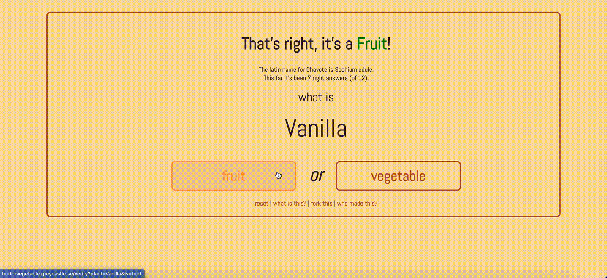

# fruitorvegetable

Ruby on rails application for a simple this-or-that game

## Code walkthrough

Most of the code is in the [app/views/base](./app/views/base) folder really.

I built this app before I knew much about Ruby and it doesn't use a database or have any tests. There is just one controller for all the pages and that has the methods to generate and verify responses.